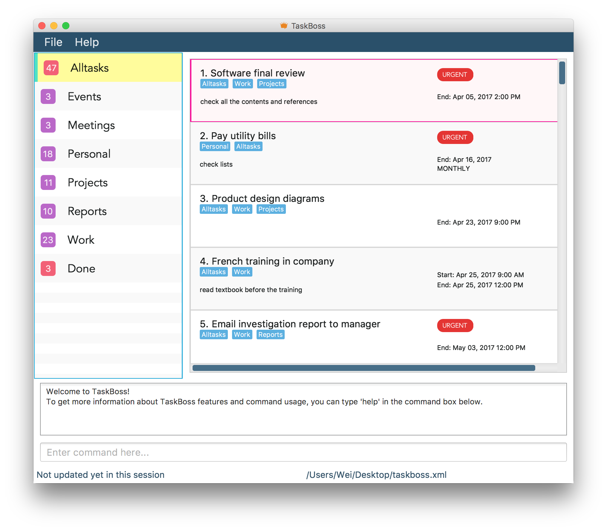

# TaskBoss - User Guide

By : `Team W14-B2`  &nbsp;&nbsp;&nbsp;&nbsp; Since: `Mar 2017`  &nbsp;&nbsp;&nbsp;&nbsp; Licence: `MIT`

---

1. [Introduction](#1-introduction)
2. [Quick Start](#2-quick-start) 
    2.1 [Download](#21-download) 
    2.2 [Launch](#22-launch) 
    2.3 [Visual Introduction](#23-visual-introduction) 
3. [Features](#3-features) 
    3.1 [Viewing help: `help / h`](#31-viewing-help--help--h) 
    3.2 [Adding a task: `add / a / +`](#32-adding-a-task--add--a--plus-sign) 
&nbsp;&nbsp;&nbsp;&nbsp;&nbsp;3.2.1 [Accepted Date Format](#321-accepted-date-format) 
&nbsp;&nbsp;&nbsp;&nbsp;&nbsp;3.2.2 [Accepted Time Format](#322-accepted-time-format) 
    3.3 [Listing all tasks: `list / l`](#33-listing-all-tasks--list--l) 
    3.4 [Editing a task: `edit / e`](#34-editing-a-task--edit--e) 
    3.5 [Finding task(s) by keywords or by datetime: `find / f`](#35-finding-tasks-by-keywords-or-by-datetime--find--f) 
    3.6 [Deleting task(s): `delete / d / -`](#36-deleting-tasks--delete--d--minus-sign) 
    3.7 [Clearing tasks by category: `clear / c`](#37-clearing-tasks-by-category--clear--c) 
    3.8 [Viewing a task: `view / v`](#38-viewing-a-task--view--v) 
    3.9 [Renaming a category: `name / n`](#39-renaming-a-category--name--n) 
    3.10 [Marking task(s) done: `mark / m`](#310-marking-tasks-done--mark--m) 
    3.11 [Terminating task(s): `terminate / t`](#311-terminating-tasks--terminate--t)  
    3.12 [Unmarking task(s): `unmark / um`](#312-unmarking-tasks--unmark--um)  
    3.13 [Undoing a command: `undo / u`](#313-undoing-a-command--undo--u) 
    3.14 [Redoing a command: `redo / r`](#314-redoing-a-command--redo--r)  
    3.15 [Sorting tasks: `sort / s`](#315-sorting-tasks--sort--s) 
    3.16 [Saving the data: `save / sv`](#316-saving-the-data--save--sv) 
    3.17 [Exiting the program: `exit / x`](#317-exiting-the-program--exit--x) 
4. [FAQ](#4-faq)
5. [Command Summary](#5-command-summary)

## 1. Introduction
Have you ever been overwhelmed with too many tasks? Perhaps a couple of these tasks might have slipped your mind. Well, TaskBoss is here to help you out! TaskBoss is a user friendly task manager which supports a wide range of features. 
 
Be the boss of your tasks, use TaskBoss today!

## 2. Quick Start

### 2.1. Download
1. Ensure you have Java version `1.8.0_60` or later installed in your Computer. 
2. Download the latest `TaskBoss.jar` from the [releases](../../../releases) tab as shown in Figure 1. 

<h5 align="left">Figure 1: Locating TaskBoss.jar in the Releases Tab</h5>
3. Copy the jar file to the folder you want to use as the home folder for TaskBoss.

### 2.2. Launch
To launch TaskBoss, double-click on `TaskBoss.jar`. The Graphical User Interface (GUI) should appear in a few seconds. 
Figure 2 below shows the sample GUI of TaskBoss pre-loaded with tasks.

<h5 align="left">Figure 2: Sample GUI of TaskBoss Pre-loaded with Tasks</h5>

### 2.3. Visual Introduction

<h5 align="left">Figure 3: Main Components of the GUI of TaskBoss</h5>

1. **Category List Panel** 
Displays a list of all categories created by the user when adding tasks to TaskBoss. The highlighted category is the current showing category in TaskBoss.
    * Note that Alltasks and Done categories are built-in categories of TaskBoss and are labelled with a different colour.
    * Categories are automatically sorted based on alphabetical order, with the exception of Alltasks being always on top and Done at the bottom of the panel.
    * When the user adds a task, the task is automatically included in Alltasks category.
    * When the user marks a task done, the task is automatically moved to Done category.

2. **Task List Panel** 
Displays a list of tasks under a particular category, if specified. Otherwise, it displays all tasks that exist in Taskboss. 
The following are some general properties of each task:
    * Tasks in TaskBoss are sorted by end dates in ascending order by default.
    * A task has seven parameters, which are _task name_, _information_, _start date_, _end date_, _categories_, _priority level_ and _recurrence_.
    * A task can be tagged with multiple categories.
    * An overdue task is highlighted in red as shown in task #1 in Figure 3.
    * A high priority task has the  label attached as shown in task #1 in Figure 3.

3. **Command Box** 
Provides a box where user commands are entered.

4. **Result Display** 
Displays result messages and user feedback.

5. **Status Bar** 
Displays the filepath where TaskBoss' data is currently saved in. The filepath displayed will be updated whenever there are changes in the filepath via the `save` command.

## 3. Features

**List of Commands**

|Command    |Description                                                          |
|:---------:|:-------------------------------------------------------------------:|
|[**help / h**](#31-viewing-help--help--h)                       |View help              |
|[**add / a / +**](#32-adding-a-task--add--a--plus-sign)                         |Add a task             |
|[**list / l**](#33-listing-all-tasks--list--l)                  |List the tasks         |
|[**edit / e**](#34-editing-a-task--edit--e)                     |Edit a task            |
|[**find / f**](#35-finding-tasks-by-keywords-or-by-datetime--find--f)           |Find tasks by keywords or by datetime             |
|[**delete / d / -**](#36-deleting-tasks--delete--d--minus-sign)                |Delete a task          |
|[**clear / c**](#37-clearing-tasks-by-category--clear--c)       |Clear tasks in category|
|[**view / v**](#38-viewing-a-task--view--v)                    |View a task            |
|[**name / n**](#39-renaming-a-category--name--n)         |Rename a category      |
|[**mark / m**](#310-marking-tasks-done--mark--m)               |Mark a task as done and updates task's dates    |
|[**terminate / t**](#311-terminating-tasks--terminate--t)          |Terminates a recurring task    |
|[**unmark / um**](#312-unmarking-tasks--unmark--um)       |Unmarks previously marked or terminated tasks and updates task's dates | 
|[**undo / u**](#313-undoing-a-command--undo--u)                 |Undo a task            |
|[**redo / r**](#314-redoing-a-command--redo--r)                 |Redo a task            |
|[**sort / s**](#315-sorting-tasks--sort--s)                     |Sort tasks by deadline or by priority|
|[**save / sv**](#316-exporting-the-data--save--sv)                |Save TaskBoss          |
|[**exit / x**](#317-exiting-the-program--exit--x)               |Exit TaskBoss          |

**General Command Format**
>
> * Words in `UPPER_CASE` are the parameters.
> * Items in `SQUARE_BRACKETS` are optional.
> * Items with `...` after them can have multiple instances.
> * Parameters can be in any order.

### 3.1. Viewing help : `help / h`

Opens the user guide in a separate window 
Format: `help`

### 3.2. Adding a task : `add / a / plus sign`

Adds a task 
Format: `add TASK_NAME [i/INFO] [sd/START_DATE] [ed/END_DATE] [c/CATEGORY...] [p/PRIORITY_LEVEL] [r/RECURRENCE]`

> * The added task is included in `Alltasks` category by default.
> * Task name and information can take both alphanumeric and non-alphanumeric characters.
> * Start and end dates are automatically formatted into _Month Day_of_month, Year Time_, `i.e Apr 14, 2017`.
> * Priority level is `no` by default, and can be either `yes` or `no` OR `y` or `n` (case-insensitive).
> * Category is configured to be in the lowercase form with the first letter in the uppercase form, `i.e c/work` will be `Work`.
> * Recurrence is `none` by default, and can be either `daily`, `weekly`, `monthly` or `yearly` (case-insensitive).
> * Prefixes are i/, sd/, ed/, c/, p/, and r/ (case-sensitive).

Examples:

* `add Email progress report ed/19-02-2017 c/Project p/YES r/weekly`
* `a Dinner with Jim i/In Orchard road sd/next friday ed/19-02-2017 c/Meeting p/no`
* `+ Contract signing sd/tomorrow at 3 PM c/Work i/company merger`

#### 3.2.1. Accepted Date Format
Date can be either in the UK format `i.e dd-mm-yyyy` or the US format `i.e mm-dd-yyyy` depending on the region and date settings of your computer. It can also be in natural language `i.e this sunday` and is case-insensitive. 
Table 1 below shows some examples of the accepted date format in the UK format.

| Date Format     | Example(s)           | Formatted Result   |
|-----------------|----------------------|--------------------|
| Month/day       | 3/19                 | Mar 19, 2017       |
| Day Month       | 1 Dec                | Dec 01, 2017       |
| Month Day       | Nov 1                | Nov 01, 2017       |
| Day of the week | thurs, Thursday      | (relative)         |
| Relative date   | today, tmr, next fri | (relative)          |
<h5 align="left">Table 1: Examples of Accepted Date Format</h5>

#### 3.2.2. Accepted Time Format
Time should be in the 24-hour clock format `i.e 1830`, or the 12-hour clock format with `AM` or `PM` (case-insensitive) `i.e 6:30 PM`. 
Table 2 below shows some examples of the accepted time format.
 
| Time Format     | Example(s)                              | Formatted Result   |
|-----------------|-----------------------------------------|--------------------|
| 24-hour         | 22                                      | 10:00 PM           |
| 12-hour         | 7.20pm                                  |  7:20 PM           |
| Hour:Minute     | 10:30                                   | 10:30 AM           |
| Hour.Minute     | 10.30                                   | 10.30 AM           |
| Relative time   | this morning, this afternoon, tonight   | (relative)         |
<h5 align="left">Table 1: Examples of Accepted Time Format</h5>

### 3.3. Listing all tasks : `list / l`

Shows a list of all tasks 
Format: `list` 

Shows a list of tasks under a specified category  
Format: `list c/CATEGORY NAME` 

Examples:
* `list`
* `l c/Project` 

### 3.4. Editing a task : `edit / e`

Edits an existing task 
Format: `edit INDEX [TASK NAME] [i/INFO] [sd/START_DATE] [ed/END_DATE] [c/CATEGORY] [p/PRIORITY_LEVEL] [r/RECURRENCE]`

> * Edits the task at the specified `INDEX`.
    The index refers to the index number of the task in the current showing category. 
    The index **must be a positive integer** (*e.g. 1, 2, 3, ...*).
> * At least one of the optional paramaters must be provided.
> * Existing task details will be updated to the new input values.
> * Order of the optional parameters does not matter.

Examples:

* `edit 1 i/Use Stack ed/23:59` 
  Edits the task information and end time of the first task to be `Use Stack` and `23:59` respectively.
  
* `e 3 p/yes` 
  Edits the priority level of third task to yes. 

### 3.5. Finding task(s) by Keywords or by Datetime : `find / f`

Finds tasks whose names or information contain any of the given keywords 
Format: `find KEYWORDS` 

Finds tasks whose start datetime matches the given datetime 
Formats: `find sd/date and time` `find ed/date and time`

> * The search for name is case-insensitive. e.g `Project` will match `project`.
> * The order of the named keywords does not matter. e.g. `meeting project` will match `project meeting`.
> * Only full words will be matched when searching by keywords. e.g. `meeting` will match `meetings`.
> * A specific date can be searched in the UK-time format with slashes, `i.e dd-mm-yyyy` or natural language which also supports searching for a specific month, `i.e december`. 
> * Any numeric day of month or year can also be searched, `i.e 2017`.

Examples:

* `find Meeting` 
  Returns all tasks whose name or information contains the word `Meeting`.
  
* `find airport CEO` 
  Returns all tasks whose name or information contains at least one of the keywords: `airport` and `CEO`.

* `find sd/2 april` 
  Returns all tasks with start date on 2nd April of the current year.
  
* `f ed/february` 
  Returns all tasks with end date in February.
  
### 3.6. Deleting task(s) : `delete / d / minus sign`

Deletes the specified task 
Format: `delete INDEX...`

> * Deletes the task(s) at the specified `INDEX`.  
> * The index numbers refers to the index number of the task in the current showing category.  
> * The index numbers **must be a positive integer** (*e.g. 1, 2, 3, ...*).
> * Multiple indexes are allowed. All tasks at the specified indexes will be deleted.

Examples:

* `list` 
  `delete 2` 
  Deletes the second task.
  
* `d 1 2` 
  Deletes the first and second task.
  
* `find meeting` 
  `- 1` 
  Deletes the first task in the results of the `find` command.

### 3.7. Clearing tasks by category : `clear / c`

Clears all tasks under the specified category 
Format: `clear c/CATEGORY`

Clears all tasks 
Format: `clear`

> * Category names are case-insensitive.  
> * The built-in categories are `Alltasks` and `Done`.  
> * Clearing `Alltasks` will result in the clearance of all the tasks except for those under the `Done` catgeory.  
> * Clearing `Done` will result in the clearance of all the tasks under `Done`.  

Examples:

* `clear c/work` 
 clears all tasks with the category `work`
 
 * `clear` 
 clears all tasks under all categories

### 3.8. Viewing a task : `view / v`

Highlights the specified task 
Format: `view INDEX`

> * Highlights the task at the specified `INDEX`.  
> * The index refers to the index number of the task in the current showing category. 
> * The index **must be a positive integer** (*e.g. 1, 2, 3, ...*).

Examples:

* `view 1` 
 Highlights the first task

### 3.9. Renaming a category : `name / n`

Renames a category  
Format: `name EXISTING_CATEGORY NEW_CATEGORY`

> * Renames the specified `EXISTING_CATEGORY` category to `NEW_CATEGORY`, provided that `EXISTING_CATEGORY` exists in TaskBoss. 
> * The Category List Panel will be automatically sorted by alphabetical order after the `name` command. 
> * Built-in categories, `Alltasks` and `Done`, cannot be renamed.
> * Existing categories cannot be renamed to the two built-in categories, `Alltasks` or `Done`.

Example:

* `name work project` 
 Renames `work` category to `project` as shown in Figure 4 below.
 

<h5 align="left">Figure 4: Illustration of Renaming a Category</h5>

### 3.10. Marking task(s) done : `mark / m`

Marks non-recurring task(s) as done and updates recurring task(s)' dates 
Format: `mark INDEX...`

> * Marks the task(s) as done at the specified `INDEX` if the task(s) is(are) non-recurring.  
> * Updates the start and end dates of the task(s) if the task(s) is(are) recurring based on the 
recurrence type, which can be `daily`, `weekly`, `monthly` or `yearly`. 
> * Start and end dates of the recurring task(s) will be incremented by either a day, a week, a month or a year.
> * The index number refers to the index number of the task in the current showing category. 
> * The index number **must be a positive integer** (*e.g. 1, 2, 3, ...*).
> * Multiple indexes are allowed. All tasks at the specified indexes will be marked or updated.

Examples:
 
 * `list` 
  `mark 1 2` 
  Marks the first and second task as done if they are non-recurring.  
  Otherwise, increments both start and end dates (if present) of the first and second task according to their specified recurrence type. 
  
 * `find meeting` 
 `mark 1` 
 Marks the first task listed in the task list panel after the `find` command as done if it is non-recurring. 
 Otherwise, increments both start and end dates (if present) of the task according to its specified recurrence type. 

### 3.11. Terminating task(s) : `terminate / t`

Terminates recurring task(s) 
Format: `terminate INDEX...`

> * Terminates the task(s) at the specified `INDEX` as long as the task(s) is(are) recurring.  
> * The index number refers to the index number of the task in the current showing category. 
> * The index number **must be a positive integer** (*e.g. 1, 2, 3, ...*).
> * Multiple indexes are allowed. All tasks at the specified indexes will be terminated.
> * Terminate will move the task(s) to the `Done` category

Examples:
 
 * `list` 
  `t 1 2` 
  Terminates the first and second tasks, assuming that they are recurring tasks. 
  
 * `find meeting` 
 `terminate 1` 
 Terminates the first task listed in the result of `find`command, assuming that it is a recurring task.  
 
### 3.12. Unmarking task(s) : `unmark / um`

Re-instates previously marked or terminated task(s) 
Format: `unmark INDEX...`

> * Unmarks the task(s) at the specified `INDEX`.  
> * If the the task(s) is(are) recurring, both its start and end dates (if present) will be incremented based on its recurrence type.
> * Unmark will move the task(s) from the `Done` category to their initial categories from before they were marked or terminated.
> * The index number refers to the index number of the task in the current showing category. 
> * The index number **must be a positive integer** (*e.g. 1, 2, 3, ...*).
> * Multiple indexes are allowed. All tasks at the specified indexes will be unmarked.

Examples:
 
 * `list` 
  `unmark 1 2` 
  Unmarks the first and second tasks. 
  If any of the tasks is recurring, both its start and end dates (if present) will be incremented based on its recurrence type.
  
 * `find meeting` 
 `unmark 1` 
 Unmarks the first task in the result of the `find`.  
 If the task is recurring, both its start and end dates (if present) will be incremented based on its recurrence type.

### 3.13. Undoing a command : `undo / u`

Undoes the most recent command and reverts to previous state 
Format: `undo`
> * `Undo` command can be executed until all previous undo-able commands are exhausted.
> * `Save` command is not undo-able.

### 3.14. Redoing a command : `redo / r`

Redoes the most recent command after it has been undone 
Format: `redo`
> * `Redo` command can be executed as long as an undo command was called previously and has not been redone.
> * `Save` command is not redo-able.

### 3.15. Sorting tasks : `sort / s` 

Sorts tasks by priority level 
Format: `sort p` 
> * Tasks with high priority will take precedence as shown in Figure 5 below.
> * Tasks with the same priority level are sorted based on the previous sorting criteria. 

<h5 align="left">Figure 5: Illustration of Sorting by Priority</h5>

Sorts tasks by start dates 
Format: `sort sd`
> * Tasks with earlier start dates will take precedence.
> * For tasks with the same start dates, a task without time specified will take precedence. `i.e May 09, 2017` comes before `May 09, 2017 2pm`.
> * Tasks with the same start dates are sorted based on the previous sorting criteria. 

Sorts tasks by end dates 
Format: `sort ed`
> * Tasks with earlier end dates will take precedence.
> * For tasks with the same end dates, a task without time specified will take precedence. `i.e Apr 14, 2017 9am` comes before `Apr 14, 2017`. 
> * Tasks with the same start dates are sorted based on the previous sorting criteria. 

### 3.16. Saving the data : `save / sv`

Saves data in _taskboss.xml_ to an existing filepath 
Format: `save EXISTING_FILE_PATH`

Creates a new filepath and saves data in _taskboss.xml_ to that filepath 
Format: `save NEW_FILE_PATH`

> * TaskBoss saves data in _taskboss.xml_ in its home folder by default if the `save` command is not used.
> * _taskboss.xml_ updates itself automatically after the user enters any command that changes the data.
> * TaskBoss rejects filepath that consists of any of the following symbols: `*` `<` `>` `?` and `|`.
> * TaskBoss automatically replaces `:` (colon) found in a filepath with `/` (forward slash) in Mac OS as Mac OS does not support filepaths with colons.
> * If a non-filepath or random string input is provided, TaskBoss automatically creates a folder with name of that input and places it in its home folder.
> * TaskBoss loads data from the last specified filepath every time it is re-loaded.

### 3.17. Exiting the program : `exit / x`

Exits the program 
Format: `exit`

## 4. FAQ

**_Q: How do I save my task data in TaskBoss?_**  
TaskBoss saves your data to `taskboss.xml` in your home folder by default whenever your task list is updated. There is no need to save manually. You can also change the storage location using the `save` command.

**_Q: How do I transfer my data to another computer?_**  
A: Download TaskBoss in the other computer and overwrite the empty data file it creates with the file that contains the data of your previous TaskBoss.

## 5. Command Summary

 

|Command    |Parameters                                                        |
|:---------:|:-------------------------------------------------------------------------------------------|
|[help / h](#31-viewing-help--help--h)                       |**`help`**              |
|[add / a / +](#32-adding-a-task--add--a--plus-sign)                         |**`add TASK_NAME [i/INFO] [sd/START_DATE] [ed/END_DATE] [c/CATEGORY] [p/PRIORITY_LEVEL] [r/RECURRENCE]`**             |
|[list / l](#33-listing-all-tasks--list--l)                  |**`list` `list c/CATEGORY NAME`**        |
|[edit / e](#34-editing-a-task--edit--e)                     |**`edit INDEX [TASK NAME] [i/INFO] [sd/START_DATE] [ed/END_DATE] [c/CATEGORY] [p/PRIORITY_LEVEL] [r/RECURRENCE]`**|
|[find / f](#35-finding-tasks-by-keywords-or-by-datetime--find--f)|**`find KEYWORDS`  `find sd/date and time`  `find ed/date and time`**|
|[delete / d / -](#36-deleting-tasks--delete--d--minus-sign)                |**`delete INDEX...`**         |
|[clear / c](#37-clearing-tasks-by-category--clear--c)       |**`clear c/CATEGORY NAME`** |
|[view / v](#38-viewing-a-task--view--v)                    |**`view INDEX`**             |
|[name / n](#39-renaming-a-category--name--n)         |**`name EXISTING_CATEGORY NEW_CATEGORY`**       |
|[mark / m](#310-marking-tasks-done--mark--m)               |**`mark INDEX...`**        |
|[terminate / t](#311-terminating-tasks--terminate--t)              |**`terminate INDEX...`**      |
|[unmark / um](#312-unmarking-tasks--unmark--um)              |**`unmark INDEX...`**      |
|[undo / u](#313-undoing-a-command--undo--u)                 |**`undo`**            |
|[redo / r](#314-redoing-a-command--redo--r)                     |**`redo`**            |
|[sort / s](#315-sorting-tasks--sort--s)                     |**`sort ed` `sort sd` `sort p`**   |
|[save / sv](#316-exporting-the-data--save--sv)                |**`save FILE_PATH` `save NEW_FILE_PATH`**|
|[exit / x](#317-exiting-the-program--exit--x)               |**`exit`**           |

 
